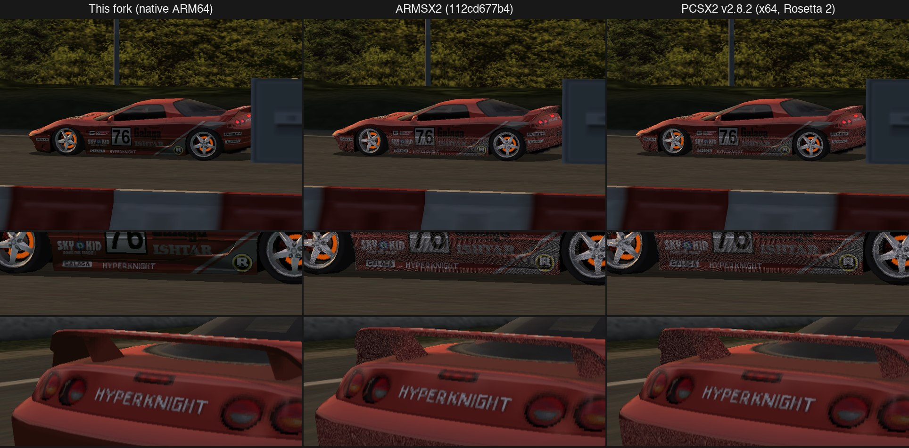

# PCSX2 for Apple Silicon (at-ima fork)

This is a personal fork of [PCSX2](https://github.com/PCSX2/pcsx2) that runs
natively on Apple Silicon Macs. Upstream PCSX2 has no ARM64 recompilers, so its
macOS build runs its x86 recompilers under Rosetta 2. This fork adds native
ARM64 block recompilers for every PS2 processor, multi-threaded VU1 (MTVU) on
ARM64, and Metal renderer changes aimed at 4K. (The NEON VIF unpacker and
the basic ARM64 build are upstream's.)

It is experimental and is not affiliated with or supported by the PCSX2 team.
Please do not report problems with this build to upstream PCSX2.

## What is different from upstream

| Area | Change | Where |
| --- | --- | --- |
| EE (R5900) | Native block recompiler with NEON packed integers, COP1 (FPU), COP2 macro mode, block linking and chaining | `pcsx2/arm64/EE*` |
| IOP (R3000A) | Native block recompiler; idle loops are skipped like the x86 recompiler | `pcsx2/arm64/Iop*` |
| VU0 | Native micro-mode block recompiler | `pcsx2/arm64/VU0*` |
| VU1 | Native trace recompiler with compile-time pipeline scheduling, deferred flag/queue regions, entry-state profiles and block linking | `pcsx2/arm64/VU1*` |
| MTVU | Multi-threaded VU1 works with the ARM64 backend | `pcsx2/MTVU.cpp`, `pcsx2/arm64/VU1Recompiler.cpp` |
| Metal renderer | Hardware depth for GEQUAL test-only draws on Apple GPUs; cached native-scaling downsamples; MetalFX spatial upscaling | `pcsx2/GS/Renderers/Metal` |

Anything a recompiler does not compile falls back to the existing
interpreters, instruction by instruction, through the same architectural
state. Differential unit tests compare the native code with the interpreters
(`tests/ctest/core`).

Design notes and the full investigation log (with measurements for every
change) are in [pcsx2/arm64/README.md](pcsx2/arm64/README.md) and
[pcsx2/arm64/PERFORMANCE.md](pcsx2/arm64/PERFORMANCE.md).

## Design differences from upstream PCSX2 and ARMSX2

Upstream PCSX2's recompilers (x86 only, so Rosetta 2 on a Mac) and ARMSX2
(which ports those recompilers, including microVU, to ARM64) share one
design. This fork's ARM64 backend was written from the interpreters instead,
and makes different trade-offs.

| | Upstream x86 / ARMSX2 | This fork |
| --- | --- | --- |
| Reference model | microVU's own timing model: stalls from `mVUincCycles`, pipeline state carried between blocks in `microRegInfo` | The interpreters' architectural state: the VU FMAC/FDIV/EFU/IALU queues and flags in `VURegs` stay exactly as the interpreter would leave them at every point where C++ code can observe them |
| Unsupported instructions | Every instruction is compiled or called from compiled code; nothing drops back to the interpreter loop | Anything not compiled runs in the interpreter, one instruction (EE/IOP) or pair (VU) at a time, through the same state; the next block continues natively |
| VU flags | Computed only where a later instruction reads them (`mVUsetFlags`); with the VU flag hack, unread sticky bits are dropped | Computed for every FMAC op, except inside deferred regions where nothing observes them. With the VU flag hack (on by default), those ops skip flag computation entirely unless a status reader later in the region can see their sticky bits |
| VU1 pipeline | Scheduled per block from the incoming `microRegInfo` | Scheduled at compile time from the block's code, plus variants compiled for the exact incoming pipeline state (entry profiles); the queues are materialized only at region and block exits |
| VU1 blocks | Linked by microVU's block manager | Traces follow static and taken branches up to 256 pairs; exits link to the next block in generated code, with several targets per exit for subroutine returns |
| XGKICK | Whole-packet transfer after the next pair | Same policy, adopted from microVU |
| EE | Register allocation across instructions | Every guest register is written back after each instruction; blocks chain and link to each other |
| Testing | Game testing | Differential unit tests against the interpreters at every cycle budget, plus game testing |
| Metal renderer | Upstream GS code | Adds the Apple-specific changes above |

What this buys and costs:

- **Accuracy follows the interpreter.** Because the native code reproduces the
  interpreter's state instead of microVU's model, games that microVU gets
  wrong can render correctly here. In Ridge Racer V, the cars' lower bodies
  and rear wings are covered in speckled, noise-like shading in upstream
  PCSX2 and ARMSX2 but not in this fork (see below). Which difference causes
  it has not been pinned down.
- **More CPU time.** Keeping flags and queues exact costs CPU time. For VU1
  this is now mostly recovered: flags are computed only where they are read,
  and VU1 thread time is level with ARMSX2's in most scenes. The EE thread
  still takes more time than ARMSX2's (see the benchmarks).
- **Incremental coverage.** Instructions can be added one at a time, each
  checked against the interpreter, and anything missing still runs.



Ridge Racer V, attract-mode replay from the same save state, dumped with the
GS frame dump (`SaveFrame`) at frames 240 (top two rows) and 360 (bottom row)
after loading the state, 3x resolution on the Metal renderer. The replay is
identical in all three until about frame 700, so the frames match exactly.

## Benchmarks

Measured on 2026-10-04 on an Apple M5 MacBook Air (fanless, 32 GB, macOS 27)
from the same save states, one emulator at a time:

- **This fork** at `58f5c9597`, Release build.
- **ARMSX2** macOS arm64 build `112cd677b4`,
  which ports the x86 recompilers (microVU and friends) to ARM64.
- **Official PCSX2 2.8.2** x64 build, running under Rosetta 2.

All three used the same settings: Metal renderer, Multithreaded VU1 on, all
recompilers on, frame limiter on (60 fps), GameDB fixes on, basic blending
accuracy. Each run loads the save state, waits 15 s, then samples for about
12 s: FPS and per-thread times from six on-screen-display captures, and power
and CPU time from `proc_pid_rusage` (the energy macOS attributes to the
process). "CPU cores busy" is CPU time divided by wall time. Each run waited
for the Mac to cool down to a nominal thermal state first. Runs whose window
captures came out blank, and one ARMSX2 run with an implausible power reading
(1.2 W at 1.9 busy cores), were repeated.

**6x internal resolution (3072x2688, 4K class)**

| Game | Emulator | FPS avg (min) | Speed | EE / GS / VU1 / GPU ms per frame | Power | CPU cores busy |
| --- | --- | ---: | ---: | --- | ---: | ---: |
| Shadow of the Colossus | **This fork (native ARM64)** | 59.7 (58.4) | 100% | 8.60 / 3.96 / 6.77 / 16.36 | 3.51 W | 1.26 |
|  | ARMSX2 | 45.8 (40.6) | 76% | 6.47 / 3.78 / 4.90 / 21.45 | 2.67 W | 0.82 |
|  | PCSX2 2.8.2 x64 (Rosetta 2) | 40.2 (36.0) | 67% | 7.63 / 5.37 / 7.38 / 24.32 | 2.56 W | 0.89 |
| Burnout 3: Takedown | **This fork (native ARM64)** | 60.0 (59.9) | 100% | 7.92 / 2.64 / 2.76 / 15.51 | 4.28 W | 0.86 |
|  | ARMSX2 | 59.9 (59.9) | 100% | 4.60 / 2.26 / 2.81 / 13.68 | 3.38 W | 0.65 |
|  | PCSX2 2.8.2 x64 (Rosetta 2) | 58.4 (50.4) | 97% | 7.33 / 4.12 / 4.88 / 12.63 | 3.04 W | 1.02 |
| Ridge Racer V | **This fork (native ARM64)** | 59.9 (59.9) | 100% | 4.32 / 4.26 / 4.04 / 12.26 | 2.97 W | 0.76 |
|  | ARMSX2 | 60.0 (60.0) | 100% | 4.03 / 2.64 / 3.92 / 16.43 | 2.45 W | 0.63 |
|  | PCSX2 2.8.2 x64 (Rosetta 2) | 59.3 (57.8) | 99% | 3.71 / 2.93 / 4.14 / 10.00 | 3.63 W | 0.67 |
| Ape Escape 3 (Saru! Get You! 3) | **This fork (native ARM64)** | 59.9 (59.9) | 100% | 6.68 / 2.58 / 2.55 / 10.54 | 3.71 W | 0.73 |
|  | ARMSX2 | 59.9 (59.9) | 100% | 5.36 / 2.02 / 2.65 / 10.67 | 3.27 W | 0.64 |
|  | PCSX2 2.8.2 x64 (Rosetta 2) | 59.8 (58.5) | 100% | 6.74 / 2.19 / 3.21 / 10.11 | 3.76 W | 0.77 |

**1x internal resolution (native)**

| Game | Emulator | FPS avg (min) | Speed | EE / GS / VU1 / GPU ms per frame | Power | CPU cores busy |
| --- | --- | ---: | ---: | --- | ---: | ---: |
| Shadow of the Colossus | **This fork (native ARM64)** | 59.9 (59.9) | 100% | 7.31 / 7.07 / 7.20 / 6.92 | 6.67 W | 1.34 |
|  | ARMSX2 | 60.0 (59.9) | 100% | 6.70 / 4.59 / 6.87 / 10.52 | 6.30 W | 1.13 |
|  | PCSX2 2.8.2 x64 (Rosetta 2) | 57.5 (51.7) | 96% | 7.76 / 5.64 / 8.48 / 4.31 | 6.62 W | 1.28 |
| Burnout 3: Takedown | **This fork (native ARM64)** | 59.9 (59.9) | 100% | 7.52 / 3.04 / 2.83 / 6.32 | 4.31 W | 0.85 |
|  | ARMSX2 | 59.9 (59.8) | 100% | 5.02 / 2.82 / 3.41 / 6.99 | 2.98 W | 0.68 |
|  | PCSX2 2.8.2 x64 (Rosetta 2) | 59.9 (59.9) | 100% | 5.86 / 3.33 / 4.06 / 3.10 | 4.07 W | 0.85 |
| Ridge Racer V | **This fork (native ARM64)** | 59.9 (59.9) | 100% | 4.46 / 4.38 / 4.28 / 4.40 | 2.78 W | 0.77 |
|  | ARMSX2 | 59.9 (59.8) | 100% | 4.34 / 4.21 / 4.78 / 6.30 | 2.28 W | 0.78 |
|  | PCSX2 2.8.2 x64 (Rosetta 2) | 59.9 (58.1) | 100% | 3.47 / 2.59 / 4.01 / 1.59 | 3.47 W | 0.63 |
| Ape Escape 3 (Saru! Get You! 3) | **This fork (native ARM64)** | 59.9 (59.9) | 100% | 5.93 / 2.44 / 2.49 / 7.62 | 3.52 W | 0.68 |
|  | ARMSX2 | 60.0 (59.9) | 100% | 5.06 / 2.07 / 2.60 / 7.67 | 3.21 W | 0.61 |
|  | PCSX2 2.8.2 x64 (Rosetta 2) | 60.0 (60.0) | 100% | 6.20 / 2.69 / 3.21 / 1.29 | 3.73 W | 0.76 |

How to read this:

- With the frame limiter on, everything that keeps up shows 60 fps. The
  differences are in the thread times, power and busy cores.
- **4K (6x) Shadow of the Colossus** is the only case where the emulators
  differ in speed. ARMSX2 and the x64 build are GPU bound there (21-24 ms of
  GPU time per frame); this fork's Metal changes bring that to 16 ms. On a
  fanless Mac, back-to-back 4K runs throttle, so each run here started cool.
- **VU1 is no longer the gap.** This fork's VU1 thread time is now level with
  or below ARMSX2's in Burnout 3, Ape Escape 3 and Ridge Racer V, and within
  5% of it in Shadow of the Colossus at 1x.
- **The EE is where this fork still loses.** Its EE thread time is
  1.0-1.7x ARMSX2's (widest in Burnout 3), and overall it uses about
  1.0-1.5x ARMSX2's busy cores and power (1.5x busy cores in 4K Shadow of
  the Colossus, where it also renders 14 fps more).
- Against the x64 build under Rosetta 2, this fork now uses less power in
  Ridge Racer V and slightly less in Ape Escape 3, about the same in Shadow
  of the Colossus at 1x, and more in Burnout 3.
- The x64 build's GPU times at 1x are much lower than both ARM64 builds'.
  This has not been investigated.
- This fork's GS thread time includes a WFE spin while it waits for MTVU
  (see Known issues), so it overstates real GS work.

**Change since the previous measurement (2026-09-29, `4db5c23da`).** The EE
and VU1 work merged since then (PRs #2-#15: lazy VU1 flags, the EE GPR cache
and leaner EE links, the VU1 per-pair and block-transition work, and others)
cut this fork's CPU time:

| Game (resolution) | EE ms per frame | VU1 ms per frame | CPU cores busy |
| --- | ---: | ---: | ---: |
| Shadow of the Colossus (6x) | 13.12 → 8.60 | 12.32 → 6.77 | 2.13 → 1.26 |
| Shadow of the Colossus (1x) | 9.99 → 7.31 | 9.84 → 7.20 | 1.77 → 1.34 |
| Burnout 3 (6x) | 9.45 → 7.92 | 5.19 → 2.76 | 1.24 → 0.86 |
| Burnout 3 (1x) | 9.60 → 7.52 | 5.33 → 2.83 | 1.19 → 0.85 |
| Ridge Racer V (6x) | 5.29 → 4.32 | 5.88 → 4.04 | 1.06 → 0.76 |
| Ridge Racer V (1x) | 5.62 → 4.46 | 5.87 → 4.28 | 1.05 → 0.77 |
| Ape Escape 3 (6x) | 8.25 → 6.68 | 3.71 → 2.55 | 0.95 → 0.73 |
| Ape Escape 3 (1x) | 8.16 → 5.93 | 3.77 → 2.49 | 0.92 → 0.68 |

Watts are not compared across the two days: in the same scenes, most runs
of all three emulators read higher on 2026-10-04 than on 2026-09-29 (by up
to about 70%, for example ARMSX2 in Burnout 3 at 6x: 2.00 W, then 3.38 W),
so only same-day power comparisons are meaningful.

## Building on Apple Silicon

Requirements: macOS 13 or newer (MetalFX), Xcode (for the Metal shader
compiler), and [Homebrew](https://brew.sh). The shaders are compiled with
Xcode's `metal` tool, which the Command Line Tools do not include: if
`xcode-select -p` points at the Command Line Tools, run the build with
`DEVELOPER_DIR=/Applications/Xcode.app/Contents/Developer`.

1. Install the dependencies:

   ```sh
   brew install cmake ninja qtbase qtsvg qttools sdl3 plutosvg plutovg \
     ffmpeg shaderc rapidyaml libwebp freetype harfbuzz zstd lz4 libpng \
     jpeg-turbo molten-vk
   ```

2. Build KDDockWidgets 2.4.1 against Homebrew's Qt 6 into `deps-arm64`
   (the version `.github/workflows/scripts/macos/build-dependencies.sh` uses):

   ```sh
   curl -L -o kdd.tar.gz https://github.com/KDAB/KDDockWidgets/archive/v2.4.1/KDDockWidgets-2.4.1.tar.gz
   tar xf kdd.tar.gz && cd KDDockWidgets-2.4.1
   cmake -B build -G Ninja -DCMAKE_BUILD_TYPE=Release -DCMAKE_OSX_ARCHITECTURES=arm64 \
     -DCMAKE_PREFIX_PATH=/opt/homebrew -DCMAKE_INSTALL_PREFIX="$PCSX2_SRC/deps-arm64" \
     -DKDDockWidgets_QT6=true -DKDDockWidgets_EXAMPLES=false -DKDDockWidgets_FRONTENDS=qtwidgets
   ninja -C build install
   ```

3. Configure and build PCSX2:

   ```sh
   cmake -B build-arm64 -G Ninja -DCMAKE_BUILD_TYPE=Release \
     -DCMAKE_OSX_ARCHITECTURES=arm64 \
     -DCMAKE_PREFIX_PATH="$PWD/deps-arm64;/opt/homebrew" \
     -DENABLE_TESTS=ON
   ninja -C build-arm64
   ```

   The app is `build-arm64/pcsx2-qt/PCSX2.app`. It links Homebrew's libraries
   from `/opt/homebrew`, so it only runs on a Mac with the same Homebrew
   packages installed. If you copy the executable into another app bundle,
   re-sign it: `codesign --force --deep --sign - PCSX2.app`.

4. Run the unit tests: `build-arm64/tests/ctest/core/core_test`. All of them
   should pass.

## Recommended settings

- **Settings > Advanced:** keep the EE, IOP, VU0 and VU1 recompilers enabled
  (`[EmuCore/CPU/Recompiler] EnableEE/EnableIOP/EnableVU0/EnableVU1`).
- **Settings > Emulation:** turn on **Enable Multithreaded VU1 (MTVU)**
  (`[EmuCore/Speedhacks] vuThread = true`).
  Turning a recompiler off selects the interpreter for that processor.
- **Renderer:** Metal (Automatic selects it).
- **4K:** either render at 6x, or render at 3x-4x and set **Settings >
  Graphics > Post-Processing > Contrast Adaptive Sharpening** to **MetalFX
  Upscale (Display Resolution, Metal)**. MetalFX scales the frame to the
  window size when it is presented, which costs far less GPU time than
  rendering at 6x.

## Status and known issues

- Tested mostly from save states in Saru! Get You! 2 and 3, Ridge Racer V,
  Burnout 3 and Shadow of the Colossus. Other games may break, run slowly, or
  hang. If a game misbehaves, try turning off the recompiler for one processor
  at a time to find which one is at fault.
- CPU time and power are still up to about 1.5x ARMSX2's, mostly in the EE
  thread; see the benchmarks above.
- The GS thread waits for MTVU with a WFE spin, so it looks busy in Activity
  Monitor even while it is idle.
- See [Known issues](pcsx2/arm64/README.md#known-issues) in the ARM64 README.

---

The upstream PCSX2 README follows.

# PCSX2


[](https://app.codacy.com/gh/PCSX2/pcsx2/dashboard?utm_source=github.com&utm_medium=referral&utm_content=PCSX2/pcsx2&utm_campaign=Badge_Grade)
[](https://discord.com/invite/TCz3t9k)

PCSX2 is a free and open-source PlayStation 2 (PS2) emulator. Its purpose is to emulate the PS2's hardware, using a combination of MIPS CPU [Interpreters](<https://en.wikipedia.org/wiki/Interpreter_(computing)>), [Recompilers](https://en.wikipedia.org/wiki/Dynamic_recompilation) and a [Virtual Machine](https://en.wikipedia.org/wiki/Virtual_machine) which manages hardware states and PS2 system memory. This allows you to play PS2 games on your PC, with many additional features and benefits.

## Project Details

PCSX2 has been in development for more than 20 years. Past versions could only run a few public domain game demos, but newer versions can run most games at full speed, including popular titles such as Final Fantasy X and Devil May Cry 3. Visit the [PCSX2 compatibility list](https://pcsx2.net/compat/) to check the latest compatibility status of games (with more than 2500 titles tested).

Installers and binaries for both stable and nightly builds are available from [our website](https://pcsx2.net/downloads/).

## System Requirements

PCSX2 supports Windows, Linux, and Mac platforms. Our [setup documentation page](https://pcsx2.net/docs/setup/requirements) contains additional details on software and hardware requirements.

Please note that a BIOS dump from a legitimately-owned PS2 console is required to use the emulator. For more information, visit [this page](https://pcsx2.net/docs/setup/bios/).

## Contributing / Building

PCSX2 supports translation into other languages using [Crowdin](https://crowdin.com/project/pcsx2-emulator).

See the [Contribution Guide](https://pcsx2.net/docs/contributing/) for more info on how to contribute.
